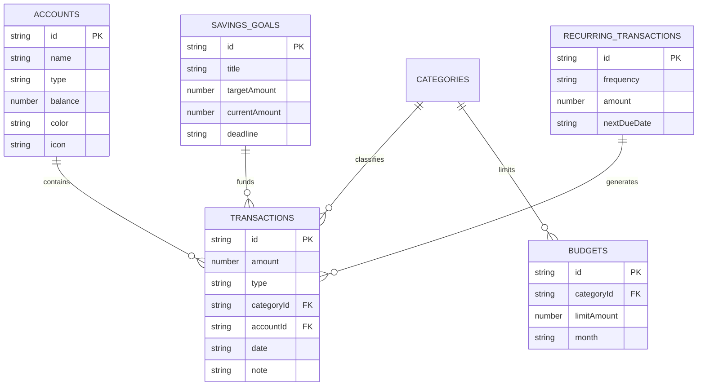

# 🍷 Tracker Budget — Luxury Personal Finance & Budget Tracker

<div align="center">


<p align="center">
  <b>Aplikasi pelacak anggaran dan keuangan pribadi desktop modern, berkelas, dan 100% offline-first.</b><br/>
  <i>A modern, elegant, and 100% offline-first personal finance management desktop application built with Tauri v2, React 19, and Dexie.js.</i>
</p>

[Fitur Utama](#-fitur-utama--key-features) •
[Desain & Estetika](#-desain--estetika-luxury-burgundy) •
[Tech Stack](#-tech-stack) •
[Arsitektur Data](#-arsitektur--database-offline-first) •
[Cara Menjalankan](#-cara-menjalankan--getting-started) •
[Pengujian](#-pengujian--testing)

---

</div>

## ✨ Highlight Utama

- 🔒 **100% Privacy & Offline-First**: Seluruh data finansial Anda disimpan secara lokal di perangkat menggunakan IndexedDB (Dexie.js). Tidak ada tracking, tidak ada server pihak ketiga, data finansial Anda sepenuhnya aman dan privat.
- ⚡ **Ringan & Cepat (Tauri v2 + Rust)**: Konsumsi memori sangat minim dibandingkan aplikasi berbasis Electron konvensional, dengan waktu boot seketika.
- 🎨 **Estetika Mewah & Eksklusif**: Mengusung palet warna **Luxury Burgundy (Velvet Wine)** berpadu dengan **Warm Cream / Sand**, terinspirasi dari standar desain finansial premium Dakingo.
- 🧪 **Kualitas Teruji**: Dilengkapi dengan unit test menyeluruh (54 tests passed) menggunakan Vitest untuk menjamin akurasi kalkulasi keuangan dan kehandalan database lokal.

---

## 🚀 Fitur Utama / Key Features

### 1. 📊 Interactive Financial Dashboard
- **Hero Banner & Quick Stats**: Menyambut pengguna dengan ringkasan status keuangan terkini dan aksi cepat untuk pencatatan transaksi baru.
- **Financial Overview Cards**: Kartu metrik dinamis yang menampilkan Total Kekayaan Bersih (*Net Worth*), Total Pemasukan Bulanan, Pengeluaran, serta persentase *Cash Flow / Burn Rate*.
- **Category Filter Bar**: Filter cepat kategori pengeluaran dan pemasukan dengan indikator visual dan animasi yang halus.
- **Smart Financial Insights**: Analisis cerdas otomatis yang mendeteksi tren pengeluaran, peringatan batas anggaran, dan saran kesehatan finansial.
- **Financial Milestone Ticket & Goals**: Pelacak pencapaian target tabungan interaktif lengkap dengan animasi selebrasi (*canvas-confetti*) saat target tercapai.

### 2. 💳 Manajemen Dompet & Rekening (Multi-Accounts)
- Kelola berbagai jenis rekening: **Tunai (Cash)**, **Rekening Bank**, **E-Wallet** (GoPay, OVO, Dana, dll.), dan **Investasi**.
- Visualisasi saldo per akun secara *real-time* dengan kustomisasi ikon dan warna.

### 3. 💸 Pencatatan Transaksi Komprehensif
- Input transaksi cepat untuk **Pemasukan**, **Pengeluaran**, dan **Transfer Antar Rekening**.
- Dukungan format mata uang fleksibel (Default: Rupiah `Rp`).
- Sistem kategori terstruktur, penambahan tag, dan pencatatan catatan rincian (*notes*).
- Pencarian dan filter transaksi berdasarkan rentang tanggal, kategori, atau akun sumber.

### 4. 🎯 Alokasi & Pelacakan Anggaran (Budgeting)
- Tetapkan batasan anggaran per kategori per bulan.
- *Progress bar* interaktif dengan indikator visual status aman, mendekati batas (*warning*), dan melebihi anggaran (*overbudget*).

### 5. 📈 Analitik & Laporan Visual
- Grafik pembagian pengeluaran (*Expense Breakdown*) berbasis *donut chart* interaktif dengan Recharts.
- Grafik tren arus kas (*Cashflow Trend*) bulanan untuk memantau perbandingan pemasukan vs pengeluaran dari waktu ke waktu.

### 6. 🔁 Transaksi Berulang (Recurring Transactions)
- Kelola pengeluaran rutin seperti langganan bulanan (*subscriptions*), tagihan utilitas, maupun pemasukan berkala secara otomatis.

---

## 🎨 Desain & Estetika (Luxury Burgundy)

Aplikasi dirancang dengan pendekatan visual elegan yang memadukan kesan klasik dan modern:

| Elemen | Kode Hex | Deskripsi |
| :--- | :--- | :--- |
| **Deep Burgundy** | `#4A0E17` | Warna aksen utama, merepresentasikan stabilitas dan kemewahan (*Velvet Wine*) |
| **Wine Accent** | `#722F37` | Warna sekunder untuk hover state, tombol aktif, dan sorotan |
| **Warm Cream** | `#FAF7F2` | Background utama yang lembut dan nyaman di mata |
| **Soft Sand Border** | `#E8E1D5` | Garis batas halus untuk menciptakan kedalaman kartu (*card elevation*) |
| **Charcoal Dark** | `#1C1917` | Tipografi tegas dengan kontras optimal |

---

## 🛠️ Tech Stack

- **Desktop Framework**: [Tauri v2](https://v2.tauri.app/) (Rust core)
- **Frontend Core**: [React 19](https://react.dev/) + [TypeScript](https://www.typescriptlang.org/)
- **Bundler & Tooling**: [Vite 7](https://vitejs.dev/)
- **Styling**: [Tailwind CSS v4](https://tailwindcss.com/)
- **Local Database**: [Dexie.js](https://dexie.org/) (Reactive IndexedDB wrapper)
- **Visualisasi & Charts**: [Recharts](https://recharts.org/)
- **Icons**: [Lucide React](https://lucide.dev/)
- **Testing**: [Vitest](https://vitest.dev/) + `@testing-library/react` + `fake-indexeddb`

---

## 🗄️ Arsitektur & Database Offline-First

Data disimpan sepenuhnya pada browser engine lokal melalui Dexie.js (IndexedDB). Skema database terstruktur mencakup:



---

## 💻 Cara Menjalankan / Getting Started

### Prasyarat (*Prerequisites*)
1. **Node.js** (v18 atau lebih baru) & **npm**
2. **Rust & Cargo** (Diperlukan untuk menjalankan desktop wrapper Tauri):
   - Ikuti panduan instalasi di [Tauri Prerequisites](https://v2.tauri.app/start/prerequisites/)

### 1. Kloning Repository
```bash
git clone https://github.com/yorr-amd/tracker-budget.git
cd tracker-budget
```

### 2. Instal Dependensi
```bash
npm install
```

### 3. Jalankan Mode Pengembangan (Frontend Saja)
Jika Anda hanya ingin mengembangkan tampilan web di browser:
```bash
npm run dev
```
Buka browser di `http://localhost:1420`.

### 4. Jalankan Aplikasi Desktop (Tauri Dev Mode)
Untuk menjalankan jendela aplikasi desktop native:
```bash
npm run tauri dev
```

### 5. Build Aplikasi Desktop untuk Produksi
Untuk menghasilkan file installer `.msi` / `.exe` (Windows):
```bash
npm run tauri build
```
File installer hasil build akan tersedia di folder `src-tauri/target/release/bundle/`.

---

## 🧪 Pengujian / Testing

Aplikasi dilengkapi suite pengujian otomatis untuk memvalidasi operasi database, manipulasi transaksi, dan logika kalkulasi:

```bash
# Menjalankan seluruh pengujian unit
npm test

# Menjalankan pengujian dalam mode interaktif (watch mode)
npm run test:watch
```

---

## 📄 Lisensi & Kontributor

- **Pengembang**: [Yori Amanda](https://github.com/yorr-amd)
- Dibuat dengan dedikasi untuk manajemen keuangan pribadi yang aman, privat, dan berkelas.
